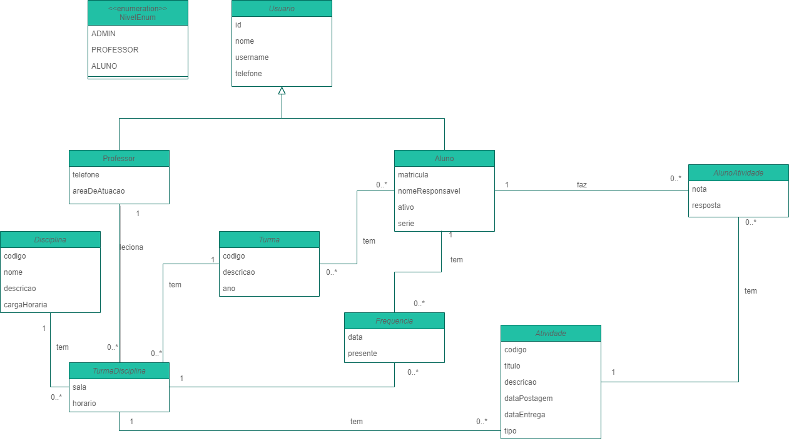

# SORAE - Sistema de Organização de Atividades Escolares

## SORAE É UMA APLICAÇÃO WEB QUE TEM COMO INTUITO AUXILIAR NA ORGANIZAÇÃO DE ESCOLAS E NA APLICAÇÃO DE ATIVIDADES NA EDUCAÇÃO BÁSICA.

### Screenshots do projeto:

### Requisitos Funcionais [RFs]:

- [RF1] - O sistema permite crud de Aluno;
- [RF2] - O sistema permite crud de Professor;
- [RF3] - O sistema permite crud de Disciplina;
- [RF4] - O sistema permite crud de Atividades;
- [RF5] - O sistema deve possuir área de autenticação para Aluno, Professor e Coordenação;
- [RF5] - A Coordenação faz as atrbuições de disciplinas a professores;
- [RF6] - A Coordenação faz as matrículas de novos alunos;
- [RF7] - O Professor poderá fazer o cadastro do planejamento da disciplina que ministrará;
- [RF8] - A Coordenação faz o cadastro das disciplinas por série;
- [RF9] - O Professor poderá realizar chamadas e o sistema armazenará as frequências dos alunos;
- [RF10]- O Professor faz atribuição de notas às atividades/provas;
- [RF11]- O Aluno enviar resposta a atividades/provas;
- [RF12]- O sistema gera um resumo (histórico acadêmico) do aluno;

### Requisitos não funcionais [RNFs]:

- [RNF1] - O sistema deverá ter alta disponibilidade, ser operável 24h por dia;
- [RNF2] - O sistema deverá se adequar facilmente à prazos e normas da escola através de cadastros do usuário coordenador;
- [RNF3] - O sistema deverá cadastradas cada aluno na quantidade máxima de materias previstas nas diretrizes da escola;
- [RNF4] - O sistema deverá permitir o cadastro máximo de 30 alunos por turma;
- [RNF5] - O sistema deverá permitir o cadastro de turmas do 1º ao 9º ano do ensino fundamental;
- [RNF6] - As páginas devem ser carregadas em até 5 seg;
- [RNF7] - Após a data de aplicação de avaliações ficará aberto automaticamente no sistema o local de atribuição de notas durante 7 dias;
- [RNF8] - O sistema deverá enviar e-mail de confirmação sobre entregas das atividades;
- [RNF9] - Os usuários deverão operar o sistema após 2 semanas de treinamento.

### Diagrama de classes UML:

### Diagrama de casos de uso:

### Tecnologias usadas:
- Java;
- Ecossistema Spring;
- JavaScript.

### Como testar o projeto?

* *Este projeto está sendo feito para fins acadêmicos para a disciplina de Projeto e Desenvolvimento de Software, no curso Bacharelado Intedisciplinar em Ciência e Tec.*
